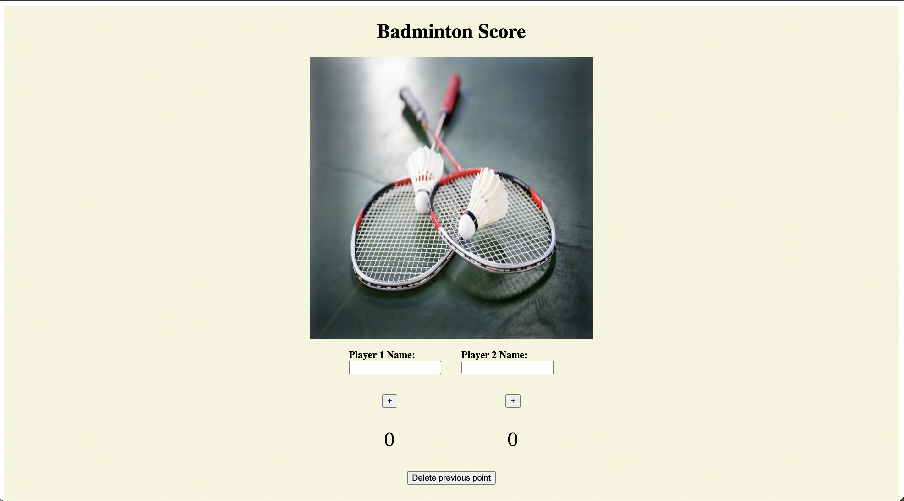

# Badminton Scoreboard

A simple badminton scoreboard application built with Svelte for the frontend and Flask for the backend.



## Features

- Add points for Player 1 and Player 2
- Displays the winner when one player reaches 21 points
- Reset the game
- Delete the last added point in case of a mistake

## Prerequisites

- [Node.js](https://nodejs.org/)
- [Python](https://www.python.org/)

## Installation

### Frontend (Svelte)

1. Clone the repository:

```
git clone https://github.com/yourusername/badminton-scoreboard.git
```

2. Change to the frontend directory: 

```
cd badminton-scoreboard/frontend
```

3. Install dependencies: 

```
npm install
```

4. Run the development server: 

```
npm run dev
```

### Backend (Flask)

1. Change to the backend directory:

```
cd badminton-scoreboard/backend
```

2. Create a virtual environment:

```
python3 -m venv venv
```

3. Activate the virtual environment:

- On macOS and Linux:

  ```
  source venv/bin/activate
  ```

- On Windows:

  ```
  .\venv\Scripts\activate
  ```

4. Install dependencies:

```
pip install -r requirements.txt
```

5. Run the Flask server:

```
python app.py
```

## Usage

1. Open your browser and visit the frontend development server at the address shown in the terminal after running the frontend code (default: http://localhost:5000). The actual port may vary depending on your configuration or other running services

2. Input player names, add points for each player, and use the "Delete Previous Point" button if necessary.

3. The application will display the winner when one player reaches 21 points. Click the "Reset" button to start a new game.
